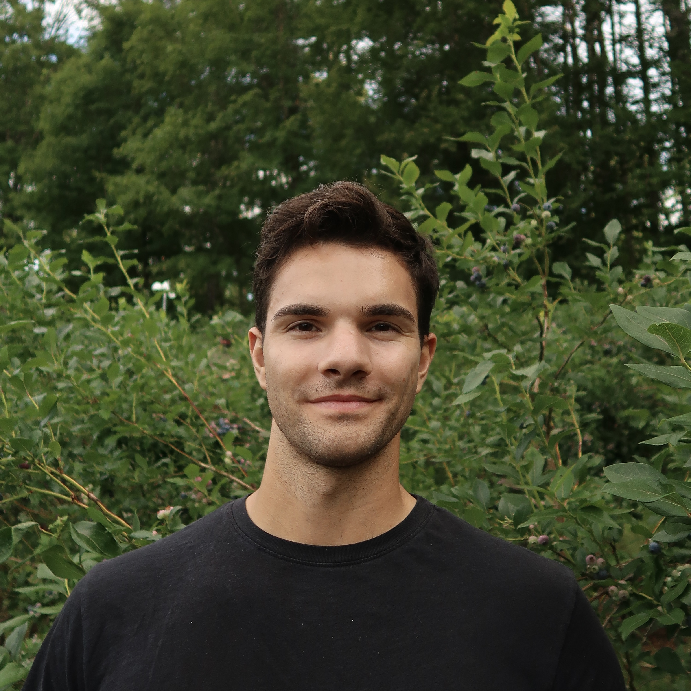

---
# Feel free to add content and custom Front Matter to this file.
# To modify the layout, see https://jekyllrb.com/docs/themes/#overriding-theme-defaults

layout: single
title: About Me
---

I am a fourth year Ph.D. student in Neuroscience at University of California, Berkeley working in Prof. [Karthik Shekhar's](https://shekharlab.github.io/) lab]. I am applying single-cell genomic methods to investigate the evolution of retinal neuronal types across vertebrates. Additionally, I have been assisting with some other collaborations, namely analyzing the spatial organization of glial subtypes in the optic nerve and classifying displaced amacrine cells using Patch-seq. More recently, I have been collaborating with Prof. [Teresa Puthussery](https://www.retinalab.berkeley.edu/) in Vision Science to validate our computational predictions using wet-lab experiments.

My research is supported by the McKnight Foundation, the Glaucoma Research Foundation, Collaborative Research in Computational Neuroscience (CRCNS), and the National Institute of Health (F31: EY038101). I hope to make contributions that will improve our understanding of diseases like glaucoma and open the door to new therapies for restoring vision. 

[Download CV](/assets/files/DT_CV_2026.pdf)

