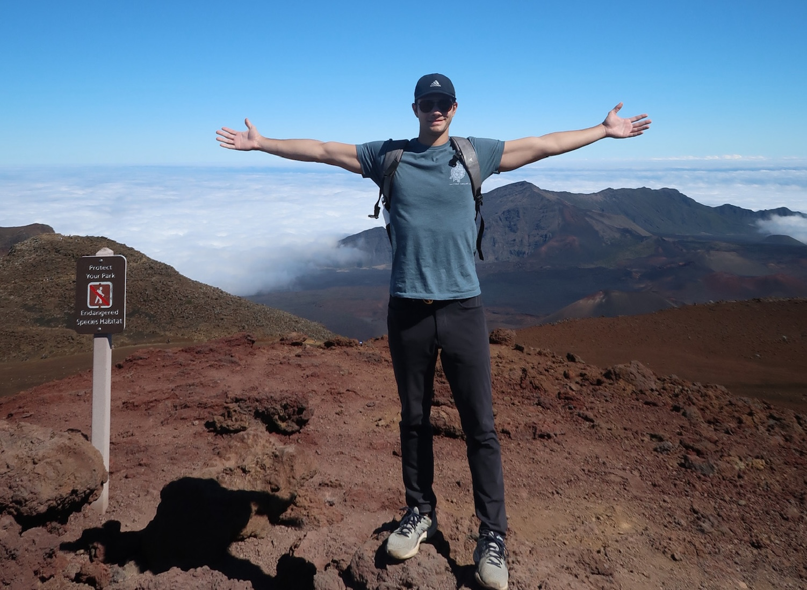

<!--<h1>Welcome!</h1>-->

<!---->
<!-- -->

Hello and welcome to my personal website! I am a PhD Candidate at UC Berkeley studying the molecular evolution and spatial organization of neurons in the [Shekhar Lab](https://shekharlab.github.io/). I am affiliated with the [Helen Wills Neuroscience Institute](https://hwni.berkeley.edu) and the [Neuroscience Department of UC Berkeley](https://neuroscience.berkeley.edu/home). Please reach out via email if you would like to get in touch!

