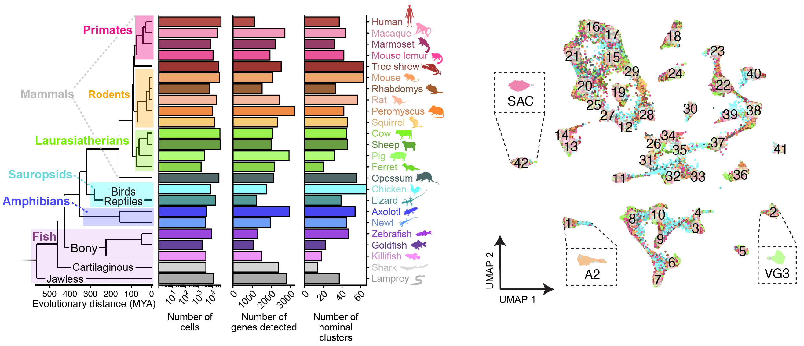
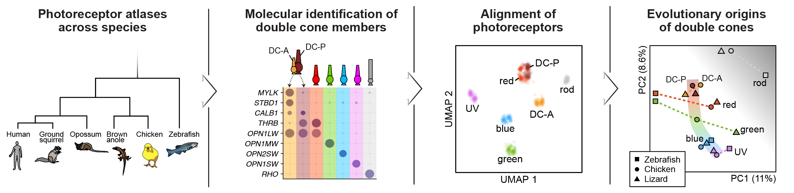
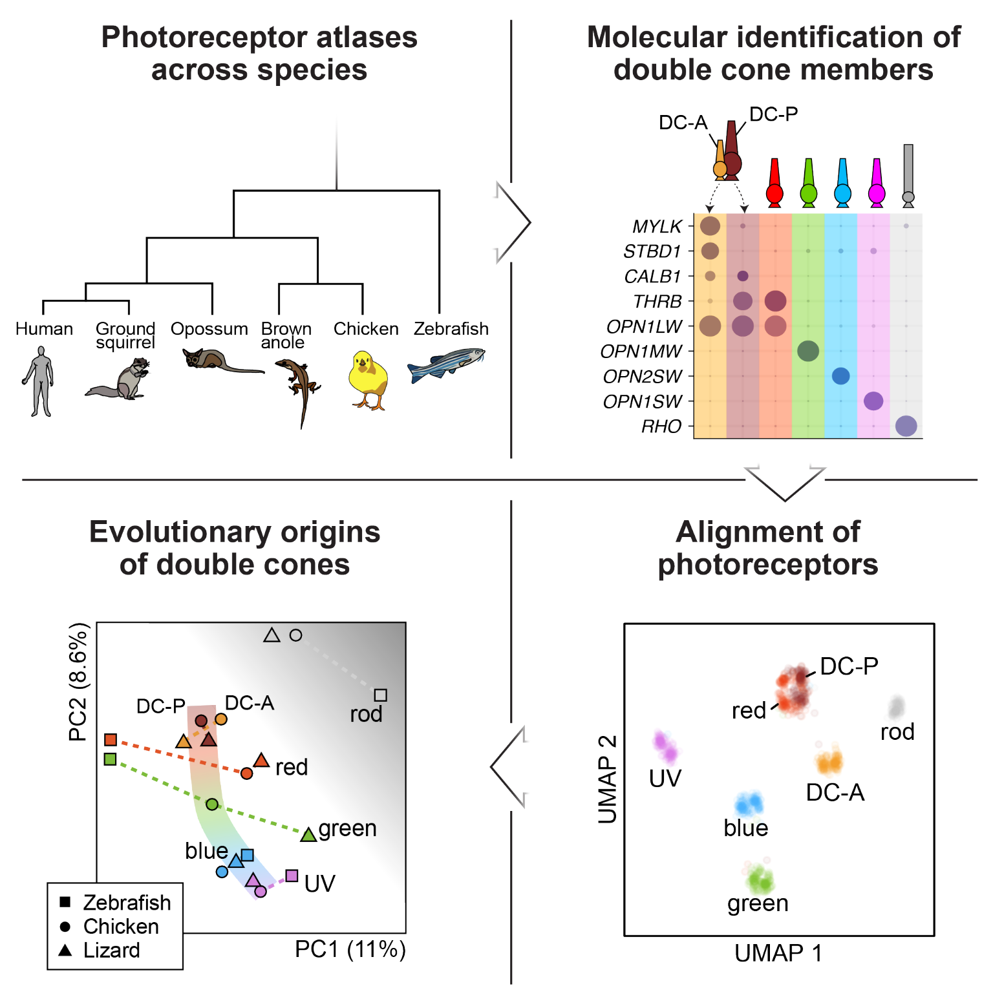
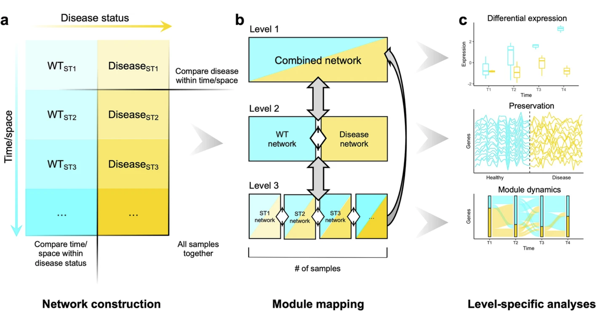
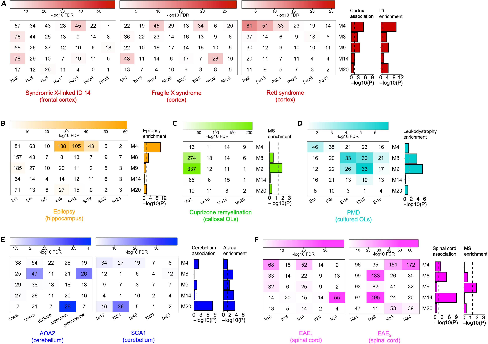
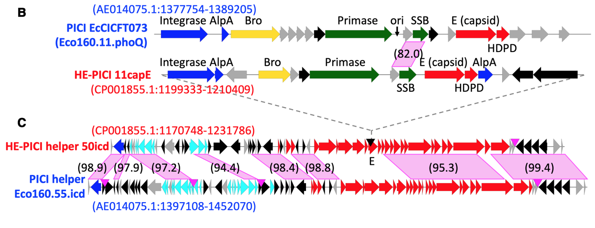

---
# Feel free to add content and custom Front Matter to this file.
# To modify the layout, see https://jekyllrb.com/docs/themes/#overriding-theme-defaults

layout: single
title: Research
---

Below are a few of my current or past research projects!

1. **Evolution of the vertebrate visual system** 
    As a graduate student in Prof. Karthik Shekhar’s lab, I've been studying amacrine cells, the primary inhibitory neurons of the retina. We performed a comparative analysis across 24 different vertebrate species, concluding that amacrine cell types are highly conserved. Many types can be traced back to basal vertebrates like fish, suggesting they are over 500 million years old! If you're interested in hearing more, check out my thread on [Bluesky](https://bsky.app/profile/dariotommasini.bsky.social/post/3mgodxm2uss2i) and read all the details in our preprint:
    
    [Tommasini D, Monavarfeshani A, Dinesh V, Hahn J, Tangeman J, Marre O, Blackshaw S, Puthussery T, Sanes JR, Shekhar K. The Extreme Diversity Of Retinal Amacrine Cells Has Deep Evolutionary Roots. *bioRxiv*. 2026.](https://doi.org/10.64898/2026.03.07.710289)
    
    
    
        
        
    In my previous PhD work, I studied the evolution of photoreceptors and the origin of the tetrapod double cone, an unorthodox pair of photoreceptors found only in certain tetrapods. These cells are called “double cones” because they are composed of two different cone photoreceptors – a principal and accessory member. Notably, we were able to i) isolate double cones in single-cell data, ii) identify novel markers for the principal and accessory members, and iii) align photoreceptors across five vertebrates that span the emergence and loss of double cones. Based on this computational analysis, we concluded that the principal member likely evolved from red cones, while the origin of the accessory member is less clear. I highlighted this work at the 2024 Berkeley Neuroscience Conference as a 5 minute lightning talk and at the 2024 Berkeley Vision Science Retreat as a 15 minute platform talk. 
    
    [Tommasini D, Yoshimatsu T, Puthussery T, Baden T, and Shekhar K. Comparative transcriptomic insights into the evolutionary origin of the tetrapod double cone. *Current Bio*. 2025.](https://doi.org/10.1016/j.cub.2025.03.060)
     
    
    
<!---->
<!---->
     
     
1. **Generation of open-source bioinformatic tools for the scientific community**  
    As an undergraduate researcher at UCLA in Prof. Brent Fogel's lab, I realized that we could extract more information from gene expression data by leveraging the multidimensionality of experimental designs. In other words, datasets with multiple time points and tissues present the opportunity to perform multiple sub-level analyses that can then be integrated together to draw more sophisticated conclusions about the underlying transcriptional networks. Since the existing software implementation, WGCNA, was not designed for this sort of analysis, I developing multiWGCNA, an R package for deep mining gene co-expression networks in multi-trait expression data. Having demonstrated that multiWGCNA reveals interesting biological phenomena in mouse models of multiple sclerosis and Alzheimer’s disease, we published my software and findings in *BMC Bioinformatics*. To ensure that these methods are more accessible to others, I submitted my package to Bioconductor – the official repository for bioinformatic software in R. These efforts will advance data analysis methods and benefit the broader neuroscientific community by making bioinformatic tools more accessible to researchers and clinicians. I have also made a commitment to keeping this software package up-to-date and to provide users with technical support. 
    
    [Tommasini D, Fogel BL. multiWGCNA: an R package for deep mining gene co-expression networks in multi-trait expression data. *BMC Bioinformatics* 24, 115 (2023).](https://bmcbioinformatics.biomedcentral.com/articles/10.1186/s12859-023-05233-z)
         
    Available on [Bioconductor](https://www.bioconductor.org/packages/release/bioc/html/multiWGCNA.html) and [GitHub](https://github.com/fogellab/multiWGCNA)
    
    
     
     
1. **Analysis of gene expression patterns associated with neurological diseases**  
    Neurological diseases differentially target specific brain regions. As an undergraduate researcher at UCLA in Prof. Brent Fogel’s lab, I investigated whether this phenomenon had a transcriptional basis. We focused primarily on oligodendrocytes (OLs), the myelinating cells of the CNS. By weighted gene co-expression network analysis (WGCNA), we found that oligodendrocyte (OL) transcriptional networks were dysregulated in various neurological diseases in a region-specific manner, e.g. cerebelllar OLs in ataxia. We then used statistical approaches to identify candidate transcription factors and microRNAs that could be regulating these expression patterns. We validated these candidates *in silico* using published data and *in vitro* using a human OL cell line. We also discovered that OL gene expression forms a gradient along the rostrocaudal axis of the mouse forebrain, which is intriguing since gradients of regulatory proteins pattern this axis during embryonic development.

    [Tommasini D, Fox R, Ngo KJ, Hinman JD, Fogel BL. Alterations in oligodendrocyte transcriptional networks reveal region-specific vulnerabilities to neurological disease. *iScience*. 2023 Mar 8;26(4):106358.](https://doi.org/10.1016/j.isci.2023.106358)
    
    
     
     
1. **Identification of a novel class of mobile genetic elements in bacteria**  
    As a Biological Research and Development intern at Sandia National Laboratories, I studied prophages – bacterial viruses that can insert their genomes within bacterial chromosomes. My advisors, Dr. Kelly Williams (PI) and Dr. Catherine Mageeney (postdoc), discovered a small “satellite” prophage inserted within a larger “helper” prophage in the chromosome of a pathogenic E. coli strain. Using bioinformatics, we discovered that the satellite is just one member of a novel clade of phylogenetically-related prophages that insert themselves within the late operon of other prophages. These experiments led us to propose that this is a novel parasitic relationship between prophages. Interestingly, this family of satellites preferentially targets helper late genes, leveraging the machinery of the helper prophage to excise and replicate. 

    [Tommasini, D, Mageeney, CM, Williams, KP (2023). Helper-embedded satellites from an integrase clade that repeatedly targets prophage late genes. *NAR Genom Bioinform*, 5, 2:lqad036.](https://doi.org/10.1093/nargab/lqad036)

    
     
     
